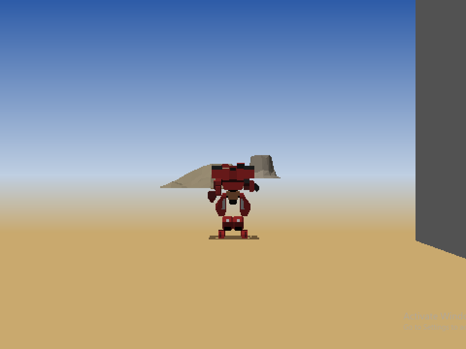
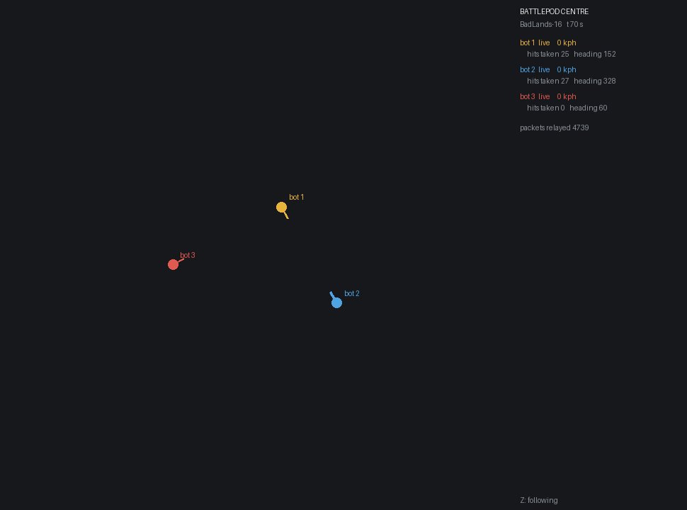

# battlepod

A bring-up harness for the Virtual World Entertainment BattleTech cockpit — the
arcade pods that ran in BattleTech Centers from 1990 to the late nineties. It
loads the pod's own software exactly the way the arcade's operator console did,
runs the cockpit's 68020, and reports what the hardware underneath was asked to
do.

There is no schematic for this board, and no emulator for it. That is not a
guess - every published manual and patent has been checked, and
[SOURCES.md](docs/SOURCES.md) says what each one does and does not contain.
This is how you find out what it was.

It sits with the sp00nznet recomp projects and follows their house style
(one repository per machine, a conformance harness, `--headless --record`,
builds and tests on netlab), but it is not a recompiler: the pod's 68020 runs
under an interpreter, which is all a 1996 board needs (see
[ROADMAP.md](ROADMAP.md), *Deferred*).

## Status

**v0.1.0 — alpha: a research tool, and now something you can play.** A game
starts the way the operator console starts one, the main view draws the
pod's own frames in a window, the keyboard is its throttle, stick and
trigger, and pods joined over UDP can destroy each other. There is no sound,
no secondary display and no heads-up display yet. Conformance: **287/287**
checkpoints (`make conformance`).

| | |
|---|---|
| Boots its own image set to the main game loop | yes |
| Renderer, audio and Amiga boards | stubbed; the renderer's display lists are read and drawn in C |
| Main view, from the pod's own frames | yes |
| Panel: lamps, displays, bar graphs (Remote I/O) | yes, one window per device |
| Keyboard as throttle, stick, trigger, target select | yes |
| Several pods over UDP, CPU pilots, the operator's view | yes (`tools/hub.py`) |
| Headless video, `--headless --record out.mp4` | yes |
| Secondary (Amiga) display, sound | no |

The cockpit boots from its own image set to `main game loop (SecCom 674 bytes).`
with three boards stubbed, and **all four of its subsystem checks now pass**.
A packet injected at the wire travels the firmware's own path - dispatch,
router, identity filter, event queue, message table, handler - and moves real
state in the cockpit's memory. It draws frames, and the display list decodes to
a viewport, a camera and a transform built from a position sent over the wire.
Ask it to, and it prints its own frame-rate, culling and queue statistics. And
it turns out to carry a **162-opcode interpreter**: its missions are bytecode
programs in its own ROM, and one of them runs. Along the way it parses its resource archive and
prints the index — 418 resources whose format is now decoded, including 130 3D
models with verified bounding volumes. The graphics processor
has been identified and its command protocol decoded, and the firmware's own
diagnostic monitor can be driven interactively over the modelled serial port —
far enough to make the cockpit's lamps, bar graphs and alphanumeric displays
emit real Remote I/O packets, checksums and all. See
[DEVICES.md](docs/DEVICES.md) for the map, [RENDERING.md](docs/RENDERING.md) for what it
would take to reproduce all four of a cockpit's surfaces,
[GAMES.md](docs/GAMES.md) for the three game modes the ROM turns out to carry -
BattleTech, Red Planet and Martian Football - and
[ROADMAP.md](ROADMAP.md) for what's next,
[docs/](docs/) for the whole technical record - including
[what turned out to be wrong](docs/FALSE-TRAILS.md) and [what is still
assumed or papered over](docs/UNRESOLVED.md) - and
[ARCHITECTURE.md](docs/ARCHITECTURE.md) for the programs, how they fit
together, and where they are going. What a BattleTech Center and its cockpits
were is at the top of [DEVICES.md](docs/DEVICES.md#the-machine-at-a-glance).

It does not contain, and will never contain, any VWE code or data. You supply
your own copy.

## Screenshots



*The main view on the netlab test VM: a MadCat walking toward the Loki on
BadLands, every polygon placed by the pod's own display list - arms
included, which the pod's own record chooses (RENDERING.md, *The arms*).*



*`tools/hub.py --bots 3 --arena --console`: three pods, each a whole emulated
cockpit, flown by CPU pilots, seen from above.*

## Getting Started

### Quick start

1. Download the repository (the green *Code* button, *Download ZIP*) and
   unzip it, or clone it.
2. Get *VWE Release 13.1.8* from the Internet Archive:
   <https://archive.org/details/vwe-release-13.1.8>, and extract it with
   `unar` (or have the `.sit` to hand: setup extracts it if `unar` is there).
3. Run **`Setup.cmd`** on Windows, or **`./setup.sh`** elsewhere.

Setup checks the prerequisites below and asks before installing any that are
missing (MSYS2 on Windows, through `winget`), asks where your release is,
then runs exactly the commands in *Step by step*: `make deps`, `make`,
`make cockpit`, `make test`. It ends with a launcher, `Play.cmd` (or
`./play`), that starts a game. If it stops, it says what to do in one
sentence and keeps the details in `setup.log`; run it again and it carries
on. It never downloads or copies the VWE release: you point it at yours.

### Step by step

**Prerequisites**

- A C compiler: GCC 9+ or Clang 10+. On Windows, MSYS2's MINGW64 shell
  (`pacman -S mingw-w64-x86_64-gcc make`), not Git Bash, which has no
  compiler.
- GNU `make` 4+, `git`, and Python 3.8+ for `tools/` and `make deps`
- SDL2 2.0.10+ and `pkg-config`, for the cockpit's windows (`make cockpit`,
  `make view`, `make panel`); the emulator itself needs neither
- [The Unarchiver CLI](https://theunarchiver.com/command-line) (`unar`), to
  unpack the release - it is a StuffIt archive with Macintosh resource forks
- Optional: `ffmpeg` on `PATH`, for `--record`

The usual trip-ups: on Windows, `python` can be the Microsoft Store's alias,
which opens the Store instead of running anything - inside MSYS2 install
`mingw-w64-x86_64-python` (or turn the alias off under *App execution
aliases*). Tools installed while a terminal is open are not on its `PATH`
until you open a new one.

**1. Get the release.** `battlepod` ships no game data. Download
*VWE Release 13.1.8* from the Internet Archive:
<https://archive.org/details/vwe-release-13.1.8>

**2. Extract it.** Use a short destination path — the archive nests deeply
enough to hit Windows' 260-character path limit.

```
unar -k visible -o /path/to/vwe "VWE Release 13.1.8.sit"
```

Both `.sit` files in that item contain the same 85 entries; one is a StuffIt 4.5
re-stuff for compatibility. Either will do.

**3. Build.**

```
git clone <this repo> battlepod && cd battlepod
make deps      # clones Musashi into third_party/
make
make cockpit   # the emulator with its windows; needs SDL2
make test      # -> selftest OK (cpu runs, unmapped writes logged, pc tracked)
```

**4. Boot a cockpit.**

```
GF="/path/to/vwe/.../VWE Release 13.1.8/VWE Center Kit/Mac Files/2.5-3.0 Related Files/VWE Release 13.1.8/BattleTech 13.1.8/Console Files/Game Files"

./build/battlepod.exe "$GF/Full_Load_3_0" \
    --duart 11000 --rstub 3FF00000 --astub --set 40000100=1234567
```

Expected output, in the `console output` block:

```
BTS2--Up
...
TI Reset Sent
TI Reset Complete
Allocating 2000 RAM for resource map
Allocate handle 1, addr 10000000, error 0
Building resource map

Res Type 1 header found
11 12 13 14 15 16 17 18 19 22 24 27 30 31 32 ...
...
Giving load resource map command, size 1268
Load Resource Map, error 0
Freeing resource map RAM
Free, error 0

 main game loop (SecCom 674 bytes).
```

That text is the cockpit's own firmware narrating itself over its serial
console. Every line of it comes out of the pod, not out of this tool.

**5. Talk to it.** `ROM3_0` carries a complete diagnostic monitor, reached once
the game initialisation returns. Patch an `RTS` over that call to land in it
directly, and type at it:

```
./build/battlepod.exe "$GF/Full_Load_3_0"     --duart 11000 --set 2138A64=4E754E75 --duart-in 's
3
'
```

```
BattleTech 2 Test Program

a - Zero Real Time Clock
...
s - Test remote I/O devices
y - START TEST GAME (starts Secondary, TI and 68020 in tandem
z - Quit

s   s  ok!
1 - Display command
2 - Bar Graph command
3 - Lamp command
3Lamp number in hex (00 - 3b, 50 - 53 and 60)
```

The valid ranges in those prompts are the cockpit's device map, given up by the
firmware itself. Answer them and the packet reaches the wire:

```
remote i/o: 8 bytes sent on duart channel A
  0000  01 00 03 03 D3 05 01 D9
```

`01` start, node `00`, length `03`, header checksum `03`, then the payload
`D3 05 01` — lamp 5 at brightness 1 — and its checksum `D9`. The frames are
decoded back into cockpit panel state:

```
remote i/o: 1 frames decoded
  lamp 05 brightness 01
```

which is what a panel renderer consumes. See [RENDERING.md](docs/RENDERING.md).

**6. Play it.**

```
VWE_GAME_FILES="$GF" tools/play.sh
```

The lamps, displays, bar graphs and main view open as four windows. Your Mech
drops in, and after a few seconds the main view shows BadLands with a Loki
150 metres ahead. W/S throttle, A/D stick, space fires, T targets, Esc quits.

## Usage

Run with no arguments for the full option list. The ones that matter:

| flag | what it does |
|---|---|
| `--duart BASE` | model the MC68681 DUART at `BASE`; channel B is the console, captured and fed |
| `--duart-in TEXT` | type `TEXT` at the console receiver (`\r`, `\n` work) |
| `--rstub ADDR` | stub the TMS340 renderer: comm block at `ADDR`, acknowledge every command, log the queue, serve allocations |
| `--poke ADDR=HEX` | unmapped reads at `ADDR` return `HEX` |
| `--set ADDR=HEX` | write a longword into RAM after loading, for answers a device would have left there |
| `--tick ADDR` | unmapped long reads at `ADDR` return a rising counter — walks past a poll-until-it-changes handshake |
| `--clock ADDR[:N]` | free-running counter at `ADDR`, one tick per `N` instructions — the firmware's timebase, which its boot monitor maintained |
| `--vbr ADDR` | vector base register (default `02000000`, where the pod's monitor left it) |
| `--irq-level N` | interrupt level the DUART asserts |
| `--monitor [ADDR]` | install a stub boot-monitor service table (default `02000400`) and report which slots get called |
| `--packet HEX` | hand the firmware one received packet (body bytes, first is the opcode) |
| `--ram BASE:LEN` | declare a RAM region (hex); repeatable |
| `--trace N` | disassemble the first `N` instructions, marking unmapped accesses inline |
| `--dis ADDR[:N]` | disassemble `N` instructions at `ADDR` and exit |
| `--watch BASE:LEN` | also log accesses inside a mapped region, so a loaded resource shows which offsets get read and from where |
| `--csv FILE` | write the full unmapped-access table |
| `--cpu TYPE` | `68020` / `68030` / `68040` |
| `--realtime` | pace the pod's clock to the wall, as a real pod ran |
| `--headless` | open no windows (`cockpit.exe`); for RDP and CI |
| `--record FILE` | the pod's own frames as video, 25 a second of its clock, through `ffmpeg` |

Everything outside declared RAM is logged: address, width, read and write
counts, the PC that first touched it, and the last value written. That log is
how the device map in [DEVICES.md](docs/DEVICES.md) was built.

**Disassemble the TMS340 renderer:**

```
python tools/tms340dis.py "$GF/Cockpit Software/R.BIN3_0" --skip 8 --base 0xFE000000
python tools/tms340dis.py "$GF/Cockpit Software/R.BIN3_0" --skip 8 --base 0xFE000000     --count 20000 --validate
```

98% of the code segment is recognised, and 963 of 971 call and branch targets
land inside the image, which is the check that it is in sync rather than
confidently wrong. `--segments` shows the scatter-load layout; `--code`
disassembles only the segment that holds code.

**Walk the resource archive:**

```
python tools/resmap.py "$GF/Cockpit Software/battletech_ti_res"
python tools/resmap.py "$GF/Cockpit Software/battletech_ti_res" --dump 11
```

**Read a 3D model.** A type 1 resource is not a mesh, it is a threaded program
of 45 opcodes; `model.py` runs it and collects the vertices, polygons and
materials it draws:

```
python tools/model.py "$GF/Cockpit Software/battletech_ti_res" --stats
python tools/model.py "$GF/Cockpit Software/battletech_ti_res" --id 24
python tools/model.py "$GF/Cockpit Software/battletech_ti_res" --id 24 --obj out/m24.obj
```

`--stats` runs all 130 and reports the checks the data itself provides — every
model carries a bounding box its vertices have to reproduce, which is what
makes a wrong decode fail loudly instead of quietly.

**Read the roster.** The cockpit ROM carries 38 vehicle records — the skeleton
each one is drawn on, its 21 hit locations with armour and sub-part ids, and
its twelve weapon bays — plus a table of 20 weapons:

```
python tools/vehicles.py "$GF/Cockpit Software/ROM3_0"
python tools/vehicles.py "$GF/Cockpit Software/ROM3_0" --id 8
python tools/vehicles.py "$GF/Cockpit Software/ROM3_0" --weapons
python tools/vehicles.py "$GF/Cockpit Software/ROM3_0" --check
```

`--check` decodes the three loadouts that a spreadsheet in the release also
writes out in English, and compares them weapon for weapon.

**Draw a whole map.** The release's scenario files place models by id, and the
grammar came from the operator console that parses them:

```
./build/battlepod.exe "$GF/Full_Load_3_0" --scene "$GF/Scenarios/BadLands-16" --scene-out out/map.rgb
./build/view.exe out/map.rgb
```

**Draw what the pod itself put on screen.** `--frame-out` takes the camera and
the placed models out of the last display list the firmware posted and draws
them. This one gives the pod a visibility range (`0xE5` `+0x44`/`+0x48`),
creates a Mech from vehicle record `+0x08` (0 is the MadCat Prime), and stands
the viewer 40 units off facing it:

```
E5="E5 $(printf '00 %.0s' $(seq 59))00 09 27 C0 00 00 00 00 00 00 01 F4 00 00 01 F4 $(printf '00 %.0s' $(seq 20))"
F8="F8 00 00 00 00 01 00 00 00 00 $(printf '00 %.0s' $(seq 86))"
./build/battlepod.exe "$GF/Full_Load_3_0" --duart 11000 --rstub 3FF00000 --rirq --astub \
    --monitor --clock 2000808 --set 40000100=1234567 \
    --set-at 02122154 21F99AE=00000001 --set-at 02122154 21F99D2=45FA0000 \
    --set-at 02122154 21F99D6=45F8C000 --set-at 02122154 21F9AC4=41F00000 \
    --set-at 02122154 21F9AA4=43340000 \
    --packet "$E5" --packet "$F8" --frame-out out/podframe.rgb --steps 250000000
./build/view.exe out/podframe.rgb
```

**Play it.** `make cockpit`, then:

```
tools/play.sh                      # BadLands-16, MadCat Prime
tools/play.sh Nazca-24 12          # another map, a Thor Prime
```

starts a game the way the operator console does - range, vehicles, map,
`PLAYER_LINK` - and opens the cockpit with the main view drawn from the pod's
own frames, its clock paced to the wall. W/S throttle, A/D stick, space fires,
T selects a target, L the searchlight, Esc quits. Your Mech drops in first and
ignores the controls until it lands. A Loki stands 150 metres ahead.

**Record it, without a window.** `--record` draws the pod's frames as
`--frame-out` does and pipes them to `ffmpeg`, timed by the pod's own clock,
so it works over RDP, on a test VM or in CI:

```
PLAY_PKT=out/play.pkt BIN=none tools/play.sh        # the start-of-game packets
./build/cockpit.exe "$GF/Full_Load_3_0" --duart 11000 --rstub 3FF00000 --rirq --astub \
    --monitor --clock 2000808 --set 40000100=1234567 --packet-file out/play.pkt \
    --live-pod --steps 400000000 --headless --record out/game.mp4
```

`battlepod.exe` takes `--record` too (with `--realtime`, or the pod's clock
runs about forty times fast).

**Run a centre.** `tools/hub.py` runs several pods at once - each a whole
emulated cockpit in its own process - joined over UDP, starts the game on all
of them as the operator console did, and flies the bots with CPU pilots that
use the panel controls like anyone else:

```
python tools/hub.py --bots 3 --arena --console          # watch three bots fight
python tools/hub.py --human --bots 2 --arena --console  # you, two bots, and the operator's view
```

`--console` is the operator's view from above (Z follows the fighting).
Pods' own output goes to `build/pod<N>.log`.

**Start a game from a scenario.** `tools/mapsend.py` turns a scenario file
into the `0xE4` packets the console sends for a map, and `--packet-file`
feeds them. Add a vehicle and a `PLAYER_LINK` and the pod flies it with
nothing patched; see scenario 4N in `tools/conformance.sh` for the full
sequence.

```
python tools/mapsend.py "$GF/Scenarios/BadLands-16" > out/badlands.pkt
```

**Run the whole cockpit.** `make cockpit` builds the emulator with its windows
- lamps, displays, bar graphs and the main view - in one process, drawing its
own geometry in C as the firmware runs:

```
./build/cockpit.exe "$GF/Full_Load_3_0" --duart 11000 --live --mesh 463
```

**Watch the main view.** `make view` draws the pod's 480x360 in a window:

```
python tools/render.py "$GF/Cockpit Software/battletech_ti_res" --mech 452 --raw out/madcat.rgb --spin 60
./build/view.exe out/madcat.rgb --fps 24
```

**See the cockpit panel.** `make panel` needs SDL2; nothing else here does.
It draws a Remote I/O capture - lamps, displays and bar graphs - in three
windows you can drag anywhere, and left/right scrub the stream a frame at a
time:

```
./build/battlepod.exe "$GF/Full_Load_3_0" --duart 11000     --set 2138A64=4E754E75 --duart-in 's
3
05
01
' --rio-dump out/one.rio
./build/panel.exe out/one.rio
```

**Stand a mech up.** The skeletons carry a rest pose and the parts hang on it:

```
python tools/render.py "$GF/Cockpit Software/battletech_ti_res" --mech 452 --out out/madcat.png
python tools/render.py "$GF/Cockpit Software/battletech_ti_res" --mechs
python tools/model.py "$GF/Cockpit Software/battletech_ti_res" --nodes
python tools/model.py "$GF/Cockpit Software/battletech_ti_res" --zones "$GF/Cockpit Software/ROM3_0"
```

**Draw one:**

```
python tools/render.py "$GF/Cockpit Software/battletech_ti_res" --id 30 --out out/mesa.png
```

Z-buffered flat-shaded triangles at the pod's own 480x360, written as a PNG
with nothing but the standard library. Model 30 comes out as one of the terrain
mesas that stand behind the mechs in the period footage. See
[RENDERING.md](docs/RENDERING.md) for what the pod looked like and why flat shading
is the right target.

**Extract Macintosh resources** (the operator console's code lives in them):

```
python tools/macres.py "$GF/../Console 1.5.12.a01.rsrc" CODE
python tools/macres.py "$GF/../Console 1.5.12.a01.rsrc" CODE 1 out/code1.bin
```

**Recover the network protocol from an operator console log:**

```
python tools/logproto.py "$GF/../Console Log"            # message vocabulary
python tools/opscon.py "$GF/../../Console 1.5.12.a01.rsrc"   # and from the sender
python tools/opscon.py "$GF/../../Console 1.5.12.a01.rsrc" --formats
python tools/logproto.py "$GF/../Console Log" --sequence # one game start, in order
```

The console logged every message it exchanged with the pods by name. A
surviving log is a protocol specification written by the software itself.

**Find the code behind any console message:**

```
python tools/xref.py "$GF/Cockpit Software/ROM3_0" 020FFFE4 "TI Reset Complete"
#   TI Reset Complete    file 04CC59  addr 0214CC3D
#       0214CB04  pea (d16,PC)
./build/battlepod.exe "$GF/Full_Load_3_0" --dis 214CB04:20
```

The firmware is unusually talkative, so this is the fastest route into any
driver in it.

**Conformance:**

```
make conformance VWE_GAME_FILES="$GF"
```

Replays the boot and checks it still reaches every milestone it reached before,
reporting a pass count (currently 287/287). Skips with a clear message if no
release is present, since the corpus cannot be redistributed.

### A note on the CPU profile

The board is a 68020 with a 68881 FPU. Musashi only enables its FPU on the
68040 profile, so that is the default here and the tool says so on every run.
`--cpu 68020` is available and will take an F-line exception the moment the
firmware uses floating point.

## Building from source

```
make deps      # fetch Musashi
make           # build/battlepod.exe
make test      # self-check
make clean
```

`make cockpit`, `make view` and `make panel` add SDL2. A cross build names
its compiler, the build machine's compiler (for Musashi's table generator)
and its pkg-config: `make CC=x86_64-w64-mingw32-gcc HOSTCC=gcc
PKG_CONFIG=...`; `PYTHON=python3` where `python` is missing.

Day to day, builds and test runs go to
[netlab](https://github.com/sp00nznet/recomp-netlab) rather than a
workstation: its mingw builder cross-builds every exe in seconds, and its
Windows test VM runs the cockpit, plays a game and screenshots it. See
[docs/netlab.md](docs/netlab.md) for the recipe and what it took.

No dependencies beyond a C compiler and Musashi, which is MIT-licensed and
fetched rather than vendored.

## Prior art

[WarlockD/Battletech-VME-3.0-Decompile](https://github.com/WarlockD/Battletech-VME-3.0-Decompile)
(June 2024) is the only other public work on this hardware. Despite the name it
contains no decompilation — it is a research dossier: the release itself,
board photographs, and the datasheets for the parts its author identified,
with notes inviting someone to take a serious crack at it.

Those notes are worth reading before this one. They independently reach the
same load map, and the uncertainty they leave open about the renderer
("TMS34010, maybe an 020, not sure yet") is now settled — it is an 020. They
also name two parts this project had not yet
identified: the sound board's **Analog Devices ADSP-21020** DSP — which is why
`btAudio.dld` is a `.dld`, the Analog Devices downloadable-executable extension
— and the **SMC COM90C66** ARCNET controller. The System 3.0 manual confirms
the sound board carries "several Analog Devices ADSP's" with sample memory in
DRAM.

Nothing is copied from that repository into this one. It is GPL-3.0 and it
distributes the VWE material directly; this project is MIT and distributes
none. Part numbers are facts, and are credited above.

## Provenance

The software this tool reads was published by the Battletech Pod Preservation
Project at <https://archive.org/details/vwe-release-13.1.8>, with a stated hope
that someone would build exactly this. Copyright in it belongs to Virtual World
Entertainment LLC, which is still operating; BattleTech and MechWarrior are
trademarks of The Topps Company and Microsoft, licensed to VWE. This project is
not affiliated with any of them.

No VWE material is in this repository — no images, no resources, no extracted
assets, no disassembly of theirs. The tool ships; the data does not. You supply
your own copy of the release, and everything the tool generates lands in
`out/`, which is gitignored.

## Contributing

See [CONTRIBUTING.md](CONTRIBUTING.md): evidence for every claim, no VWE material in
any form, and code that is yours or MIT-compatible.

## License

MIT — see [LICENSE](LICENSE). Applies to this tool only.
